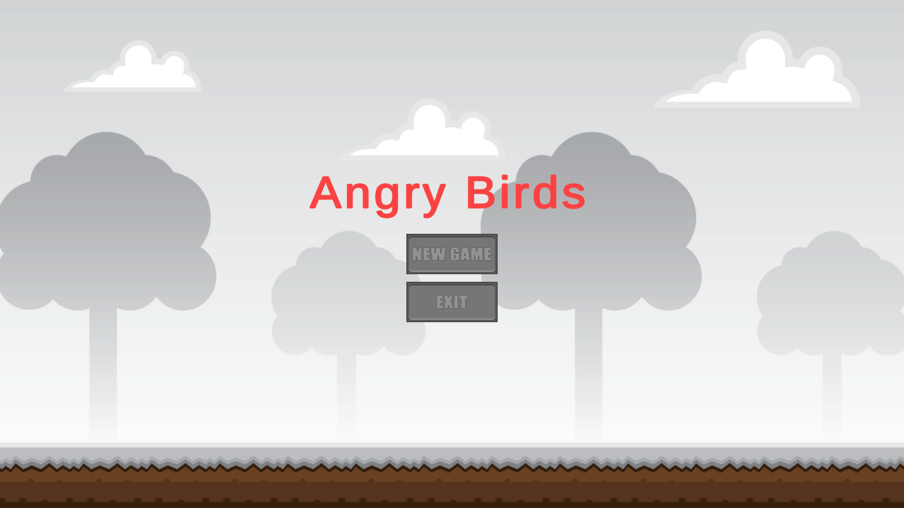
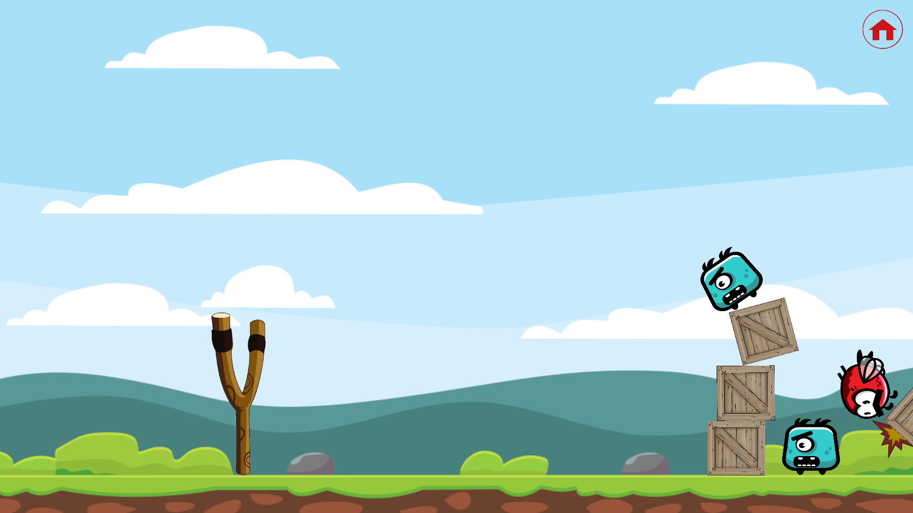
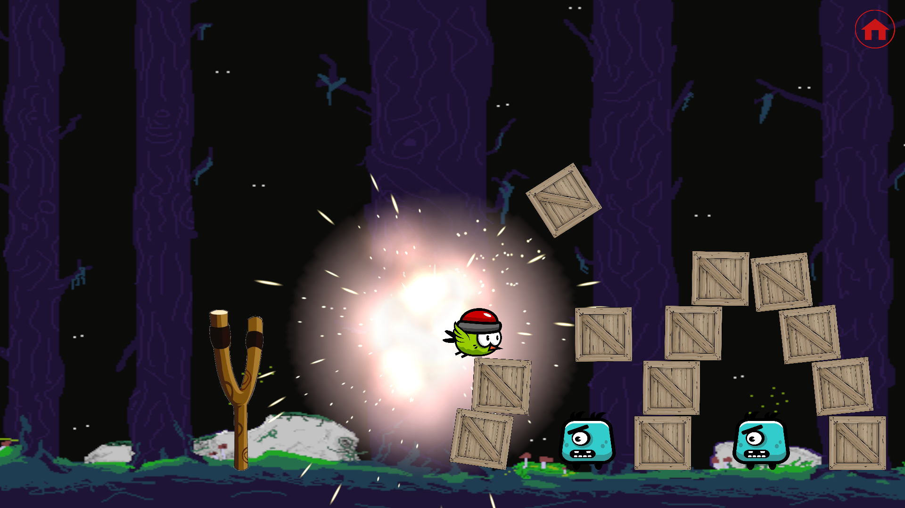
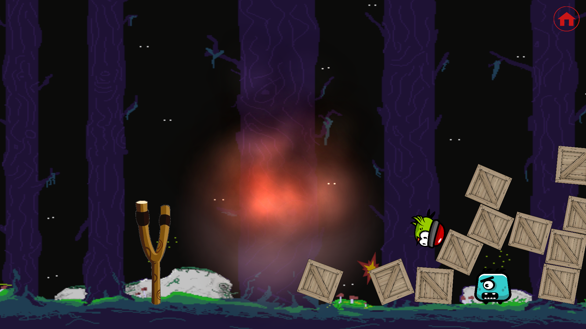

# Angry Birds

# Introduction
Welcome to Angry Birds – a fun and addictive 2D physics-based game developed in Unity using C#. This readme file provides essential information about the game, including installation instructions, gameplay, controls, and more.

# Game Overview
This game is inspired by the classic Angry Birds game, where you catapult birds to defeat the evil monsters. In this version, you'll find a main menu and two exciting levels with unique features:

* Level 1: Normal Bird: In this level, you control a regular bird with no special abilities. Your goal is to knock down crates and monsters by accurately aiming your shots.

* Level 2: Bomb Bird: In this level, you control a special bomb bird that explodes upon hitting a crate or monster. Use your bomb bird strategically to clear the path and complete the level.

# Installation
Follow these steps to install and play Angry Birds:

1. Clone or download this repository to your local machine.

2. Ensure you have [Unity](https://unity.com/download) installed.

3. Open Unity and click on "Open Project." Navigate to the AngryBird project folder and select it.

4. Go to "File" -> "Build Settings". Ensure that the target platform (e.g., Windows, Mac, Android, iOS) is correctly selected.

5. Click the "Build" or "Build and Run" button in the Build Settings window.

6. Have fun playing the game!

# Controls
* Left Mouse Button: Hold down the left mouse button on the bird to drag it. Release the button to shoot the bird.
* Home Button: Click the home button located at the top right of the screen to return to the main menu.

# Gameplay
* Launch birds at crates and monsters to clear all enemies and progress through the levels.
* In Level 2, use the bomb bird strategically to clear all enemies.

# Levels
### Level 1: Normal Bird
In this level, your bird has no special abilities. Your objective is to knock down all crates and monsters using precise aiming and well-timed launches.

### Level 2: Bomb Bird
In Level 2, you control the explosive bomb bird. When this bird hits a crate or monster, it detonates, causing massive destruction. Use the bomb bird strategically to clear the path and eliminate multiple monsters in one shot.

# Credits
Developer: Ethan Lin

Game Engine: Unity

Programming Language: C#

Artwork: [OpenGameArt](https://opengameart.org/)

&nbsp;

Thank you for playing AngryBird! If you encounter any issues or have suggestions for improvements, please feel free to report them. Have fun!

&nbsp;

Project Maintainers: Ethan Lin  
Contact: ethanlin313@gmail.com